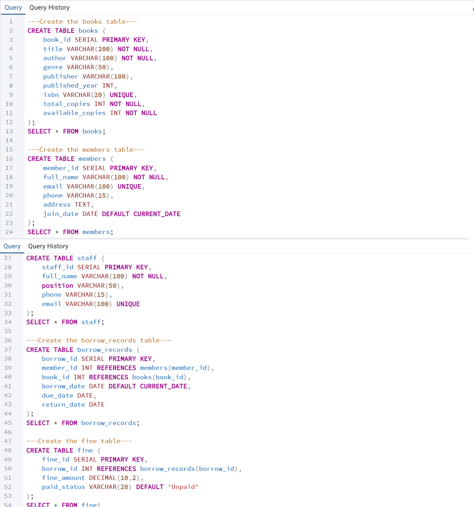
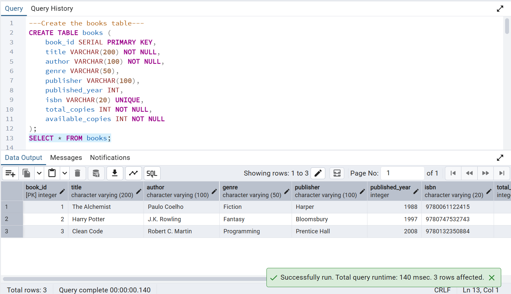
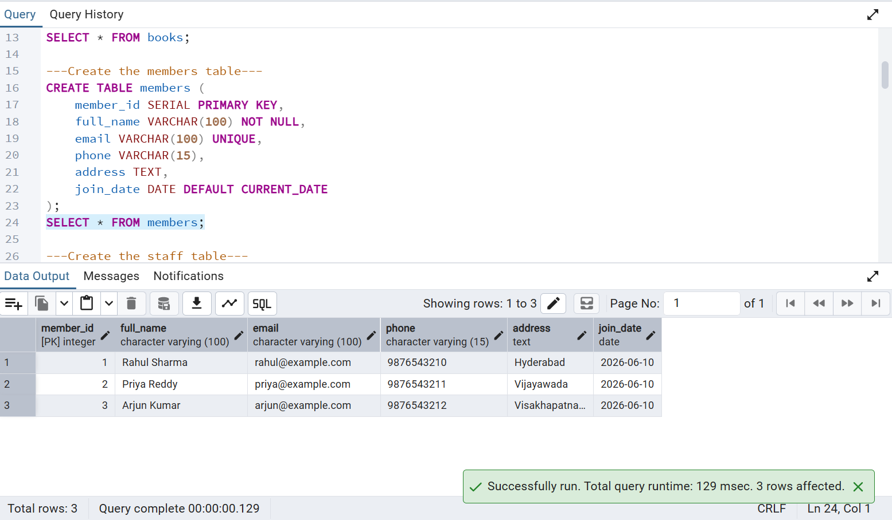
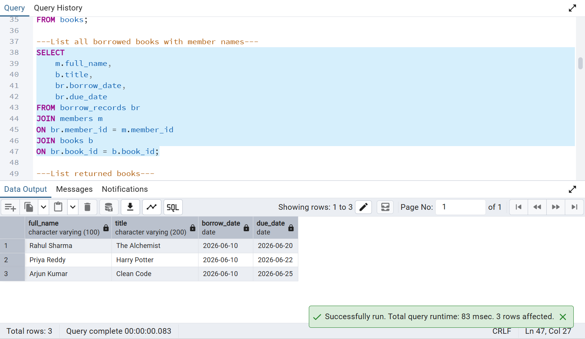
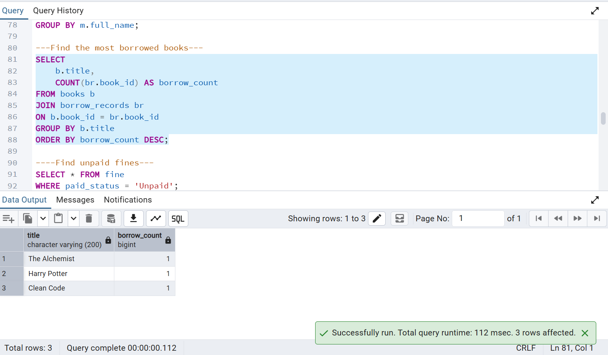
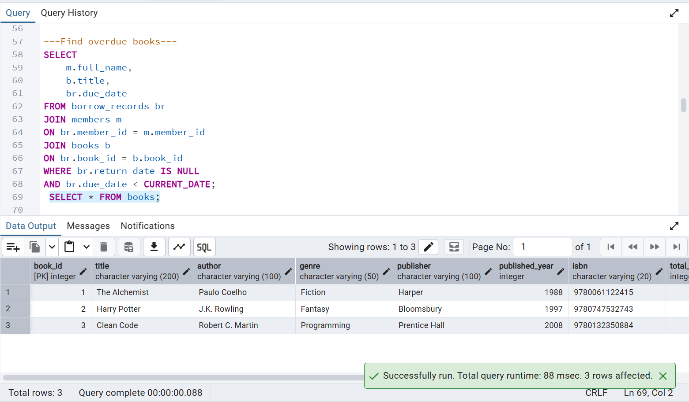
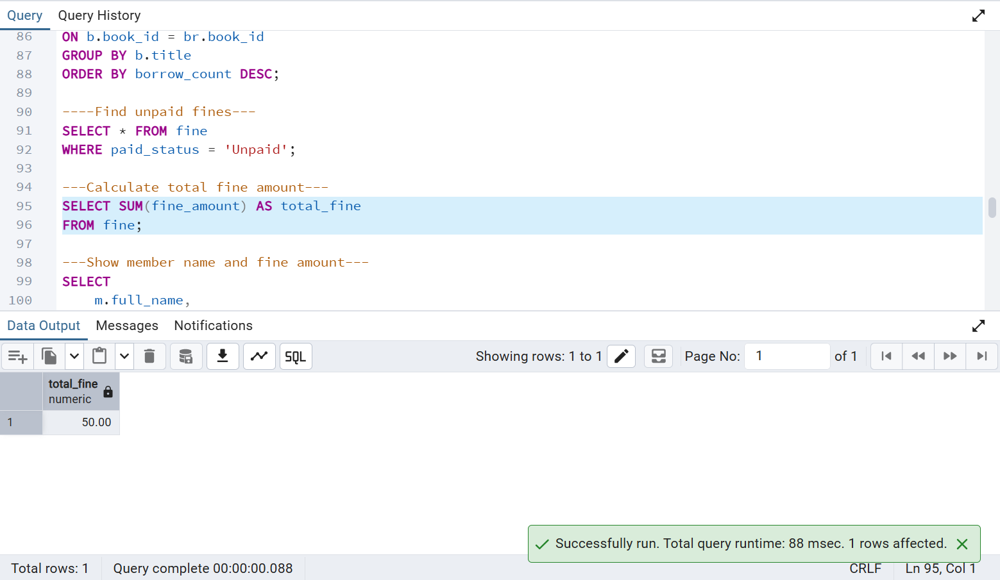

# 📚 Library Management System

A **PostgreSQL-based Library Management System** developed using **pgAdmin 4** to manage books, members, staff, borrowing records, and fines. This project demonstrates database design, SQL queries, joins, aggregate functions, views, and reporting.

---

## 🚀 Features

- 📖 Manage books and their availability
- 👥 Store member information
- 👨‍💼 Manage library staff details
- 🔄 Track borrowed and returned books
- 💰 Calculate and manage fines
- 🔗 Use JOINs to combine data from multiple tables
- 📊 Perform aggregate operations (COUNT, SUM, AVG)
- 🏆 Use Window Functions for ranking
- 👀 Create Views for simplified reporting

---

## 🛠️ Technologies Used

- PostgreSQL
- pgAdmin 4
- SQL

---

## 🗄️ Database Tables

- Books
- Members
- Staff
- Borrow Records
- Fine

---

## 📂 Project Structure

```
Library-Management-System/
│── README.md
│── create_database.sql
│── create_tables.sql
│── insert_data.sql
│── queries.sql
│── tables.png
│── books_output.png
│── members_output.png
│── join_query_output.png
│── most_borrowed_books.png
│── overdue_books.png
└── total_fine.png
```

---

## 📸 Screenshots

### 1️⃣ Database Tables



---

### 2️⃣ Books Table Output



---

### 3️⃣ Members Table Output



---

### 4️⃣ JOIN Query Output

This query displays borrowed books along with member details.



---

### 5️⃣ Most Borrowed Books



---

### 6️⃣ Overdue Books



---

### 7️⃣ Total Fine Calculation



---

## 📝 SQL Files Included

### `create_database.sql`
Creates the Library Management System database.

### `create_tables.sql`
Creates all required tables with primary keys and foreign key relationships.

### `insert_data.sql`
Inserts sample data into all tables.

### `queries.sql`
Contains 25+ SQL queries demonstrating:

- SELECT statements
- WHERE clause
- ORDER BY
- COUNT(), SUM(), AVG()
- GROUP BY
- HAVING
- INNER JOIN
- LEFT JOIN
- Window Functions
- Views
- Reporting Queries

---

## 📊 Sample Queries

```sql
SELECT * FROM books;
```

```sql
SELECT * FROM members;
```

```sql
SELECT
    m.full_name,
    b.title,
    br.borrow_date,
    br.due_date
FROM borrow_records br
JOIN members m
ON br.member_id = m.member_id
JOIN books b
ON br.book_id = b.book_id;
```

```sql
SELECT
    b.title,
    COUNT(br.book_id) AS borrow_count
FROM books b
JOIN borrow_records br
ON b.book_id = br.book_id
GROUP BY b.title
ORDER BY borrow_count DESC;
```

---

## 🎯 Learning Outcomes

Through this project, I learned:

- Relational database design
- Primary and Foreign Keys
- SQL data manipulation
- Aggregate functions
- JOIN operations
- Window functions
- Creating Views
- Writing optimized SQL queries
- Managing structured data using PostgreSQL

---

## 📌 Future Improvements

- Add Stored Procedures
- Add Triggers
- Develop a web interface
- Integrate with Python or Java
- Build a complete Library Management Application

---

## 👩‍💻 Author

**Kapa Sri Lakshmi**

GitHub: https://github.com/kapasrilakshmi075

---

## ⭐ If you found this project useful, feel free to star the repository!
